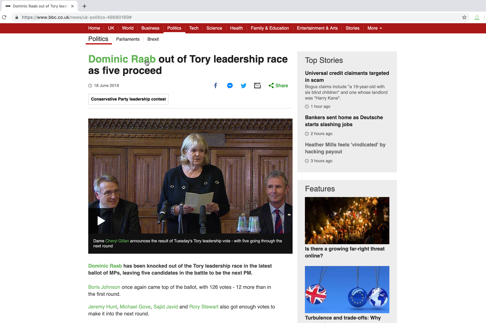
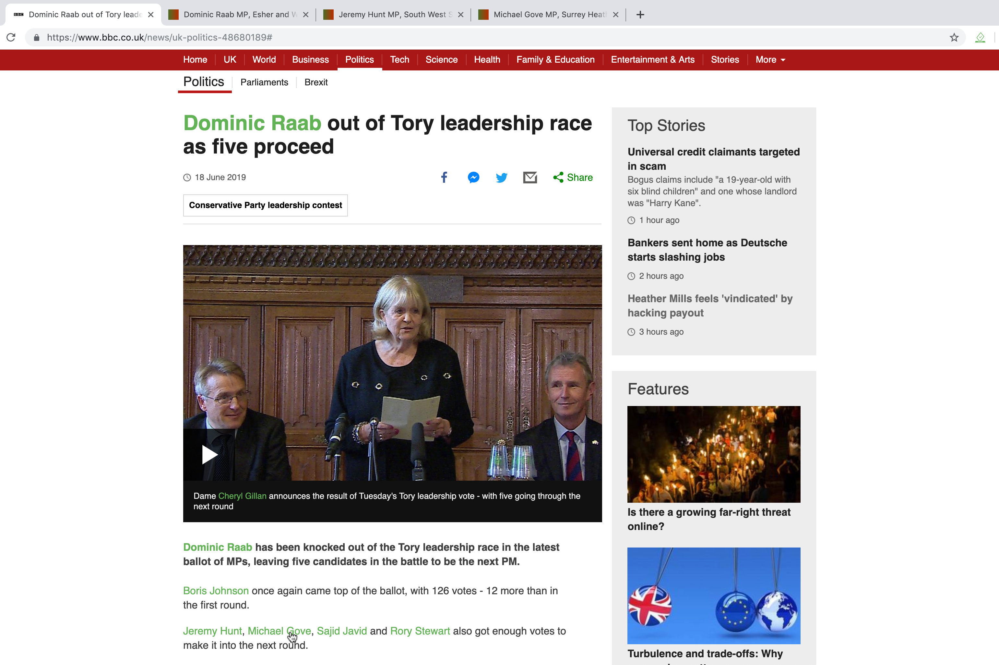
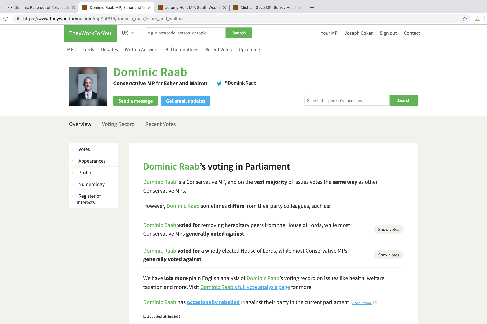

# They work for you chrome extension

With over 600 Members of Parliament it's impossible to know who they all are and what they stand for.

TheyWorkForYou is a charity that takes data from the UK Parliament, and presents it in a way that's easy to follow. They have a profile for each MP which shows their voting record, appearances and financial donations.

This extension creates a direct link to an MPs profile whenever their name appears on the webpage.

## Installation

Install the extension at [They Work For You](https://chrome.google.com/webstore/detail/they-work-for-you/oiplfbhbljjcjlennboaemogohdoodpo)

## Usage

The extension will highlight all MP's names in green. Clicking on one of these opens that MP's profile in a new tab.

## Feedback
All feedback welcome. Contact me via email at twfy.extension@gmail.com or open an issue here on github

